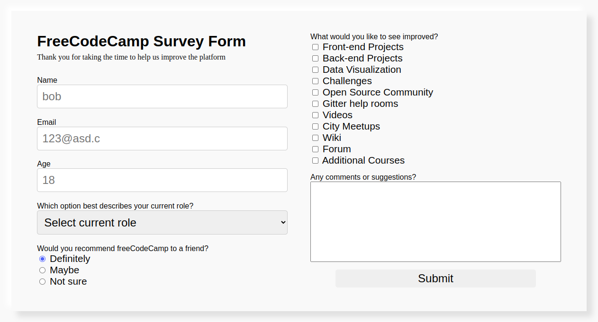

# FreeCodeCamp Survey Form

This is a survey form project, developed as part of the **FreeCodeCamp Responsive Web Design Certification**. The form allows users to submit their information and provide feedback on FreeCodeCamp.

## Project Overview

This project consists of a simple survey form built using **HTML** and **CSS**. It demonstrates core concepts of responsive web design, including form inputs, layout flexibility using **Flexbox**, and media queries for different screen sizes.

## Features

- **Responsive Layout**: 
  - The form adjusts from a side-by-side layout on wider screens to a stacked layout on smaller screens (using media queries).
  
- **Input Fields**:
  - **Name** (text input, required)
  - **Email** (email input, required)
  - **Age** (number input, min 0, max 150, required)
  - **Dropdown Menu** for selecting the user's current role.
  - **Radio Buttons** to gather user feedback on recommending FreeCodeCamp.
  - **Checkboxes** for selecting areas where improvements are needed.

- **Textarea**:
  - Users can leave additional comments or suggestions in a non-resizable text area.

- **Submit Button**:
  - A styled submit button with hover effect and smooth transition.

## Technology Used

- **HTML5**: For the form structure and input fields.
- **CSS3**: For styling, responsiveness, and layout adjustments using Flexbox and media queries.

## How to Use

1. Clone the repository or download the project files.
2. Open the `index.html` file in any modern browser.
3. Fill in the survey form fields and click "Submit" to simulate form submission.

## CSS Details

### Layout
- The form uses **Flexbox** for layout management. On screens wider than 1000px, the form fields are displayed in two columns (`left` and `right`). On smaller screens, the fields are stacked vertically.

### Responsiveness
- A media query is used to handle the layout switch:
  - For screen widths greater than **1000px**, the form is displayed in two columns.
  - For screen widths less than **1000px**, the form is displayed in a single column with full-width fields.

### Styling
- Form fields (`input`, `select`, `textarea`) are styled to have padding, border-radius, and consistent spacing.
- The `#submit` button has a hover effect where the background changes color, with a smooth transition on hover.
- The `textarea` element has a fixed maximum size and is non-resizable.

## Media Queries

The media queries adjust the layout based on screen size:
```css
@media (max-width: 1000px) {
    form {
        flex-direction: column; /* Stacks fields vertically */
        align-items: center;
    }
    .left, .right, fieldset {
        width: 100%; /* Full width for each field */
    }
}
```

## Screenshots
